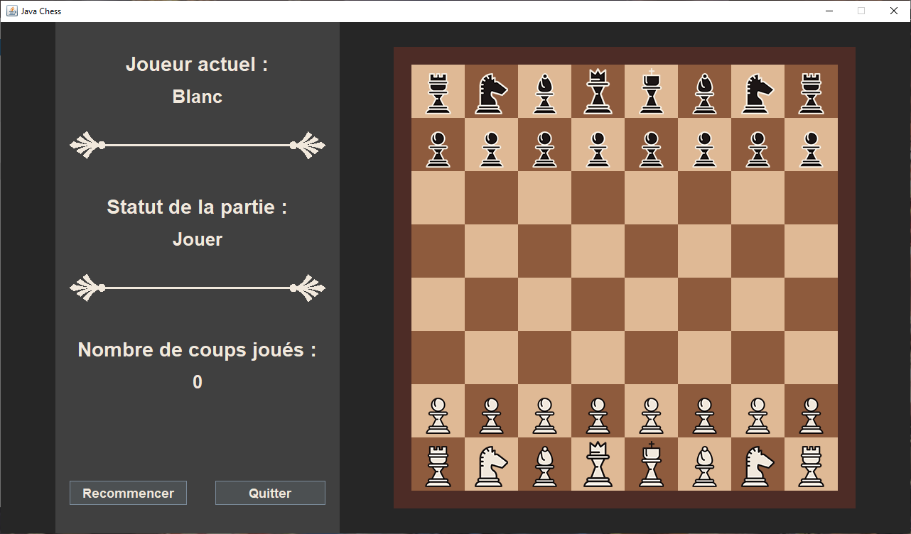

# Java-Chess

Projet Java - IT3A Esirem

# Description

Simple jeu d'échec, humain contre humain, avec une interface graphique basique, en language de programmation Java 8 et rédigé avec l'IDE IntelliJ.
Nous pouvons retrouver le code source dans le dossier "Projet" et un executable ainsi que ses ressources nécessaires dans le dossier "Executable".

  

# Auteur

[Baptiste Andres](https://github.com/LeBourguignon)
